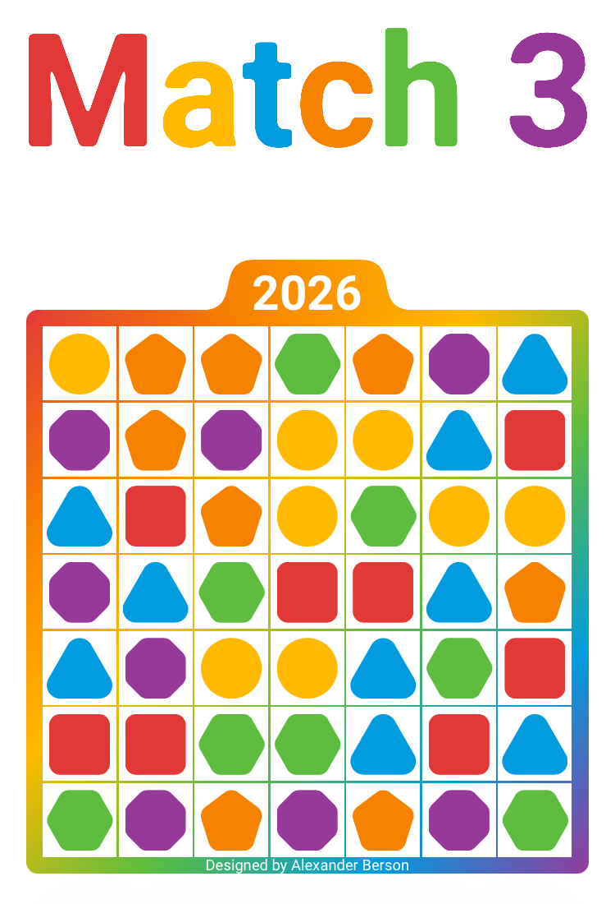

# Match 3

Score as many points as possible.  
You can [play Match 3 online](https://alex-berson.github.io/match-3/) or  

## Description

**Match 3** is a tile-matching game where players swap adjacent geometric shapes to create horizontal or vertical matches of three or more identical shapes. Matched shapes are removed from the board and replaced with new ones, which may create additional matches. Each removed shape is worth one point, and the goal is to score as many points as possible. The game ends when no swap can create a match.

## Screenshot

  

## License

Copyright &copy; 2026 Alexander Berson. This project is licensed under the [MIT license](LICENSE.txt "MIT License").

